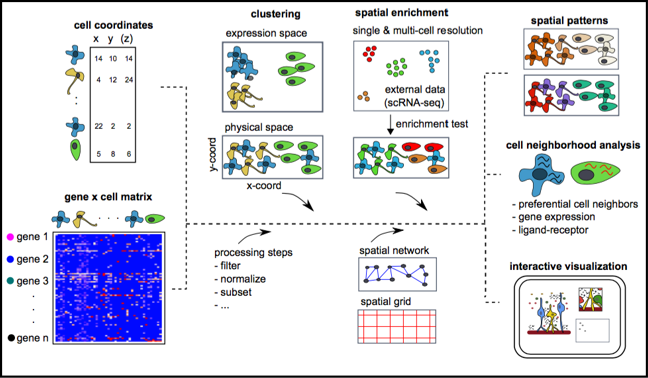

# Introduction

## Source
This pipeline is mainly used "Giotto: a toolbox for integrative analysis and visualization of spatial expression data" published on ~Genome Biology~ and its Github guideline. 

```{r}
library(devtools)  # if not installed: install.packages('devtools')
library(remotes)  # if not installed: install.packages('remotes')
remotes::install_github("RubD/Giotto") 

# compilation problems (gfortran)?
# this version does not require C compilation
remotes::install_github("RubD/Giotto@cless") 
```


## Abstract
~Spatial transcriptomic~ and proteomic technologies have provided new opportunities to investigate cells in their native microenvironment. Here we present Giotto, a comprehensive and open-source toolbox for spatial data analysis and visualization. The analysis module provides end-to-end analysis by implementing a wide range of algorithms for characterizing tissue composition, spatial expression patterns, and cellular interactions. Furthermore, single-cell RNAseq data can be integrated for spatial cell-type enrichment analysis. The visualization module allows users to interactively visualize analysis outputs and imaging features. To demonstrate its general applicability, we apply Giotto to a wide range of datasets encompassing diverse technologies and platforms.


## Data format of spatial transcriptomics 

* A matrix of gene expression per spot  

* A matirx of spot coordination  

* image (optional)  




## Pipeline Directory
1. Create a Giotto object
2. Process and filter a Giotto object
3. Dimension reduction
4. clustering
5. differential expression
6. cell type annotation
7. spatial grid
8. spatial network
9. spatial genes
10. spatial co-expression patterns
11. spatial HMRF domains
12. cell neighborhood: cell-type/cell-type interactions
13. cell neighborhood: interaction changed genes
14. cell neighborhood:  ligand-receptor cell-cell communication


# Create a Giotto object

```{r setup, include=FALSE}
all_times <- list()  # store the time for each chunk
knitr::knit_hooks$set(time_it = local({
  now <- NULL
  function(before, options) {
    if (before) {
      now <<- Sys.time()
    } else {
      res <- difftime(Sys.time(), now, units = "secs")
      all_times[[options$label]] <<- res
    }
  }
}))
knitr::opts_chunk$set(
  tidy = TRUE,
  tidy.opts = list(width.cutoff = 95),
  message = FALSE,
  warning = FALSE,
  fig.width = 10,
  time_it = TRUE
)
```

```{r}
library(Giotto)
```

### (optional) set giotto instructions
```{r eval=FALSE}
# to automatically save figures in save_dir set save_plot to TRUE
temp_dir = getwd()
temp_dir = '~/Temp/'
myinstructions = createGiottoInstructions(save_dir = temp_dir,
                                          save_plot = FALSE, 
                                          show_plot = F)
```

# Create a Giotto object  
minimum requirements:  
- matrix with expression information (or path to)  
- x,y(,z) coordinates for cells or spots (or path to)

```{r eval=FALSE}
# giotto object 
expr_path = system.file("extdata", "seqfish_field_expr.txt.gz", package = 'Giotto')
loc_path = system.file("extdata", "seqfish_field_locs.txt", package = 'Giotto')
seqfish_mini <- createGiottoObject(raw_exprs = expr_path,
                                      spatial_locs = loc_path)
```


How to work with Giotto instructions that are part of your Giotto object:  
- show the instructions associated with your Giotto object with **showGiottoInstructions**  
- change one or more instructions with **changeGiottoInstructions**  
- replace all instructions at once with **replaceGiottoInstructions**  
- read or get a specific giotto instruction with **readGiottoInstructions**  
Of note, the python path can only be set once in an R session. See the reticulate package for more information.  
```{r eval=FALSE}
# show instructions associated with giotto object (seqfish_mini)
showGiottoInstructions(seqfish_mini)
```


# Process and filter a Giotto object
- filter genes and cells based on detection frequencies  
- normalize expression matrix (log transformation, scaling factor and/or z-scores) 
- add cell and gene statistics (optional)  
- adjust expression matrix for technical covariates or batches (optional). These results will be stored in the *custom* slot. 

```{r eval=FALSE}
seqfish_mini <- filterGiotto(gobject = seqfish_mini, 
                             expression_threshold = 0.5, 
                             gene_det_in_min_cells = 20, 
                             min_det_genes_per_cell = 0)
seqfish_mini <- normalizeGiotto(gobject = seqfish_mini, scalefactor = 6000, verbose = T)
seqfish_mini <- addStatistics(gobject = seqfish_mini)
seqfish_mini <- adjustGiottoMatrix(gobject = seqfish_mini, 
                                   expression_values = c('normalized'),
                                   covariate_columns = c('nr_genes', 'total_expr'))
```


# dimension reduction
- identify highly variable genes (HVG)  
- perform PCA  
- identify number of significant prinicipal components (PCs)  
- run UMAP and/or TSNE on PCs  (or directly on matrix)  
```{r eval=FALSE}
seqfish_mini <- calculateHVG(gobject = seqfish_mini)
seqfish_mini <- runPCA(gobject = seqfish_mini)
screePlot(seqfish_mini, ncp = 20)
jackstrawPlot(seqfish_mini, ncp = 20)
plotPCA(seqfish_mini)
seqfish_mini <- runUMAP(seqfish_mini, dimensions_to_use = 1:5, n_threads = 2)
plotUMAP(gobject = seqfish_mini)
seqfish_mini <- runtSNE(seqfish_mini, dimensions_to_use = 1:5)
plotTSNE(gobject = seqfish_mini)
```


# clustering
- create a shared (default) nearest network in PCA space (or directly on matrix)  
- cluster on nearest network with Leiden or Louvan (kmeans and hclust are alternatives) 

```{r eval=FALSE}
seqfish_mini <- createNearestNetwork(gobject = seqfish_mini, dimensions_to_use = 1:5, k = 5)
seqfish_mini <- doLeidenCluster(gobject = seqfish_mini, resolution = 0.4, n_iterations = 1000)
# visualize UMAP cluster results
plotUMAP(gobject = seqfish_mini, cell_color = 'leiden_clus', show_NN_network = T, point_size = 2.5)
# visualize UMAP and spatial results
spatDimPlot(gobject = seqfish_mini, cell_color = 'leiden_clus', spat_point_shape = 'voronoi')
# heatmap and dendrogram
showClusterHeatmap(gobject = seqfish_mini, cluster_column = 'leiden_clus')
showClusterDendrogram(seqfish_mini, h = 0.5, rotate = T, cluster_column = 'leiden_clus')
```


# differential expression
```{r eval=FALSE}
gini_markers = findMarkers_one_vs_all(gobject = seqfish_mini,
                                                  method = 'gini',
                                                  expression_values = 'normalized',
                                                  cluster_column = 'leiden_clus',
                                                  min_genes = 20,
                                                  min_expr_gini_score = 0.5,
                                                  min_det_gini_score = 0.5)
# get top 2 genes per cluster and visualize with violinplot
topgenes_gini = gini_markers[, head(.SD, 2), by = 'cluster']
violinPlot(seqfish_mini, genes = topgenes_gini$genes, cluster_column = 'leiden_clus')
# get top 6 genes per cluster and visualize with heatmap
topgenes_gini2 = gini_markers[, head(.SD, 6), by = 'cluster']
plotMetaDataHeatmap(seqfish_mini, selected_genes = topgenes_gini2$genes,
                    metadata_cols = c('leiden_clus'))
```


# cell type annotation
```{r eval=FALSE}
clusters_cell_types = c('cell A', 'cell B', 'cell C', 'cell D',
                        'cell E', 'cell F', 'cell G')
names(clusters_cell_types) = 1:7
seqfish_mini = annotateGiotto(gobject = seqfish_mini, 
                              annotation_vector = clusters_cell_types, 
                              cluster_column = 'leiden_clus', 
                              name = 'cell_types')
# check new cell metadata
pDataDT(seqfish_mini)
# visualize annotations
spatDimPlot(gobject = seqfish_mini, cell_color = 'cell_types', 
            spat_point_size = 3, dim_point_size = 3)
```


# spatial grid
Create a grid based on defined stepsizes in the x,y(,z) axes.  
```{r eval=FALSE}
seqfish_mini <- createSpatialGrid(gobject = seqfish_mini,
                              sdimx_stepsize = 300,
                              sdimy_stepsize = 300,
                              minimum_padding = 50)
showGrids(seqfish_mini)
# visualize grid
spatPlot(gobject = seqfish_mini, show_grid = T, point_size = 1.5)
```


# spatial network
- visualize information about the default Delaunay network  
- create a spatial Delaunay network (default)  
- create a spatial kNN network   
```{r eval=FALSE}
plotStatDelaunayNetwork(gobject = seqfish_mini, maximum_distance = 400)
seqfish_mini = createSpatialNetwork(gobject = seqfish_mini, minimum_k = 2, 
                                    maximum_distance_delaunay = 400)
seqfish_mini = createSpatialNetwork(gobject = seqfish_mini, minimum_k = 2, 
                                    method = 'kNN', k = 10)
showNetworks(seqfish_mini)
# visualize the two different spatial networks  
spatPlot(gobject = seqfish_mini, show_network = T,
         network_color = 'blue', spatial_network_name = 'Delaunay_network',
         point_size = 2.5, cell_color = 'leiden_clus')
spatPlot(gobject = seqfish_mini, show_network = T,
         network_color = 'blue', spatial_network_name = 'kNN_network',
         point_size = 2.5, cell_color = 'leiden_clus')
```


# spatial genes
Identify spatial genes with 3 different methods:  
- binSpect with kmeans binarization (default)  
- binSpect with rank binarization  
- silhouetteRank  

Visualize top 4 genes per method.  
```{r eval=FALSE, fig.width=10, fig.height=10}
km_spatialgenes = binSpect(seqfish_mini)
spatGenePlot(seqfish_mini, expression_values = 'scaled', 
             genes = km_spatialgenes[1:4]$genes,
             point_shape = 'border', point_border_stroke = 0.1,
             show_network = F, network_color = 'lightgrey', point_size = 2.5,
             cow_n_col = 2)
rank_spatialgenes = binSpect(seqfish_mini, bin_method = 'rank')
spatGenePlot(seqfish_mini, expression_values = 'scaled', 
             genes = rank_spatialgenes[1:4]$genes,
             point_shape = 'border', point_border_stroke = 0.1,
             show_network = F, network_color = 'lightgrey', point_size = 2.5,
             cow_n_col = 2)
silh_spatialgenes = silhouetteRank(gobject = seqfish_mini) # TODO: suppress print output
spatGenePlot(seqfish_mini, expression_values = 'scaled', 
             genes = silh_spatialgenes[1:4]$genes,
             point_shape = 'border', point_border_stroke = 0.1,
             show_network = F, network_color = 'lightgrey', point_size = 2.5,
             cow_n_col = 2)
```


# spatial co-expression patterns
Identify robust spatial co-expression patterns using the spatial network or grid 
and a subset of individual spatial genes.  
1. calculate spatial correlation scores  
2. cluster correlation scores
```{r eval=FALSE, fig.width=10, fig.height=10}
# 1. calculate spatial correlation scores 
ext_spatial_genes = km_spatialgenes[1:500]$genes
spat_cor_netw_DT = detectSpatialCorGenes(seqfish_mini,
                                         method = 'network', 
                                         spatial_network_name = 'Delaunay_network',
                                         subset_genes = ext_spatial_genes)
# 2. cluster correlation scores
spat_cor_netw_DT = clusterSpatialCorGenes(spat_cor_netw_DT, 
                                          name = 'spat_netw_clus', k = 8)
heatmSpatialCorGenes(seqfish_mini, spatCorObject = spat_cor_netw_DT, 
                     use_clus_name = 'spat_netw_clus')
netw_ranks = rankSpatialCorGroups(seqfish_mini, 
                                  spatCorObject = spat_cor_netw_DT, 
                                  use_clus_name = 'spat_netw_clus')
top_netw_spat_cluster = showSpatialCorGenes(spat_cor_netw_DT, 
                                            use_clus_name = 'spat_netw_clus',
                                            selected_clusters = 6, 
                                            show_top_genes = 1)
cluster_genes_DT = showSpatialCorGenes(spat_cor_netw_DT, 
                                       use_clus_name = 'spat_netw_clus',
                                       show_top_genes = 1)
cluster_genes = cluster_genes_DT$clus; names(cluster_genes) = cluster_genes_DT$gene_ID
seqfish_mini = createMetagenes(seqfish_mini, gene_clusters = cluster_genes, name = 'cluster_metagene')
spatCellPlot(seqfish_mini,
             spat_enr_names = 'cluster_metagene',
             cell_annotation_values = netw_ranks$clusters,
             point_size = 1.5, cow_n_col = 3)
```


# spatial HMRF domains
```{r eval=FALSE}
hmrf_folder = paste0(temp_dir,'/','11_HMRF/')
if(!file.exists(hmrf_folder)) dir.create(hmrf_folder, recursive = T)
# perform hmrf
my_spatial_genes = km_spatialgenes[1:100]$genes
HMRF_spatial_genes = doHMRF(gobject = seqfish_mini,
                            expression_values = 'scaled',
                            spatial_genes = my_spatial_genes,
                            spatial_network_name = 'Delaunay_network',
                            k = 9,
                            betas = c(28,2,2),
                            output_folder = paste0(hmrf_folder, '/', 'Spatial_genes/SG_top100_k9_scaled'))
# check and select hmrf
for(i in seq(28, 30, by = 2)) {
  viewHMRFresults2D(gobject = seqfish_mini,
                    HMRFoutput = HMRF_spatial_genes,
                    k = 9, betas_to_view = i,
                    point_size = 2)
}
seqfish_mini = addHMRF(gobject = seqfish_mini,
                  HMRFoutput = HMRF_spatial_genes,
                  k = 9, betas_to_add = c(28),
                  hmrf_name = 'HMRF')
# visualize selected hmrf result
giotto_colors = Giotto:::getDistinctColors(9)
names(giotto_colors) = 1:9
spatPlot(gobject = seqfish_mini, cell_color = 'HMRF_k9_b.28',
         point_size = 3, coord_fix_ratio = 1, cell_color_code = giotto_colors)
```


# cell neighborhood: cell-type/cell-type interactions
```{r eval=FALSE}
set.seed(seed = 2841)
cell_proximities = cellProximityEnrichment(gobject = seqfish_mini,
                                           cluster_column = 'cell_types',
                                           spatial_network_name = 'Delaunay_network',
                                           adjust_method = 'fdr',
                                           number_of_simulations = 1000)
# barplot
cellProximityBarplot(gobject = seqfish_mini, 
                     CPscore = cell_proximities, 
                     min_orig_ints = 5, min_sim_ints = 5)
## heatmap
cellProximityHeatmap(gobject = seqfish_mini, CPscore = cell_proximities, 
                     order_cell_types = T, scale = T,
                     color_breaks = c(-1.5, 0, 1.5), 
                     color_names = c('blue', 'white', 'red'))
# network
cellProximityNetwork(gobject = seqfish_mini, CPscore = cell_proximities, 
                     remove_self_edges = T, only_show_enrichment_edges = T)
# network with self-edges
cellProximityNetwork(gobject = seqfish_mini, CPscore = cell_proximities,
                     remove_self_edges = F, self_loop_strength = 0.3,
                     only_show_enrichment_edges = F,
                     rescale_edge_weights = T,
                     node_size = 8,
                     edge_weight_range_depletion = c(1, 2),
                     edge_weight_range_enrichment = c(2,5))
```


### visualization of specific cell types
```{r eval=FALSE}
# Option 1
spec_interaction = "cell D--cell F"
cellProximitySpatPlot2D(gobject = seqfish_mini,
                        interaction_name = spec_interaction,
                        show_network = T,
                        cluster_column = 'cell_types',
                        cell_color = 'cell_types',
                        cell_color_code = c('cell D' = 'lightblue', 'cell F' = 'red'),
                        point_size_select = 4, point_size_other = 2)
# Option 2: create additional metadata
seqfish_mini = addCellIntMetadata(seqfish_mini,
                             spatial_network = 'Delaunay_network',
                             cluster_column = 'cell_types',
                             cell_interaction = spec_interaction,
                             name = 'D_F_interactions')
spatPlot(seqfish_mini, cell_color = 'D_F_interactions', legend_symbol_size = 3,
         select_cell_groups =  c('other_cell D', 'other_cell F', 'select_cell D', 'select_cell F'))
```


# cell neighborhood: interaction changed genes
```{r eval=FALSE}
## select top 25th highest expressing genes
gene_metadata = fDataDT(seqfish_mini)
plot(gene_metadata$nr_cells, gene_metadata$mean_expr)
plot(gene_metadata$nr_cells, gene_metadata$mean_expr_det)
quantile(gene_metadata$mean_expr_det)
high_expressed_genes = gene_metadata[mean_expr_det > 4]$gene_ID
## identify genes that are associated with proximity to other cell types
CPGscoresHighGenes =  findCPG(gobject = seqfish_mini,
                              selected_genes = high_expressed_genes,
                              spatial_network_name = 'Delaunay_network',
                              cluster_column = 'cell_types',
                              diff_test = 'permutation',
                              adjust_method = 'fdr',
                              nr_permutations = 500,
                              do_parallel = T, cores = 2)
## visualize all genes
plotCellProximityGenes(seqfish_mini, cpgObject = CPGscoresHighGenes, method = 'dotplot')
## filter genes
CPGscoresFilt = filterCPG(CPGscoresHighGenes, min_cells = 2, min_int_cells = 2, min_fdr = 0.1,
                          min_spat_diff = 0.1, min_log2_fc = 0.1, min_zscore = 1)
## visualize subset of interaction changed genes (ICGs)
ICG_genes = c('Cpne2', 'Scg3', 'Cmtm3', 'Cplx1', 'Lingo1')
ICG_genes_types = c('cell E', 'cell D', 'cell D', 'cell G', 'cell E')
names(ICG_genes) = ICG_genes_types
plotICG(gobject = seqfish_mini,
        cpgObject = CPGscoresHighGenes,
        source_type = 'cell A',
        source_markers = c('Csf1r', 'Laptm5'),
        ICG_genes = ICG_genes)
```


# cell neighborhood:  ligand-receptor cell-cell communication
```{r eval=FALSE}
LR_data = data.table::fread(system.file("extdata", "mouse_ligand_receptors.txt", package = 'Giotto'))
LR_data[, ligand_det := ifelse(mouseLigand %in% seqfish_mini@gene_ID, T, F)]
LR_data[, receptor_det := ifelse(mouseReceptor %in% seqfish_mini@gene_ID, T, F)]
LR_data_det = LR_data[ligand_det == T & receptor_det == T]
select_ligands = LR_data_det$mouseLigand
select_receptors = LR_data_det$mouseReceptor
## get statistical significance of gene pair expression changes based on expression ##
expr_only_scores = exprCellCellcom(gobject = seqfish_mini,
                                   cluster_column = 'cell_types',
                                   random_iter = 500,
                                   gene_set_1 = select_ligands,
                                   gene_set_2 = select_receptors)
## get statistical significance of gene pair expression changes upon cell-cell interaction
spatial_all_scores = spatCellCellcom(seqfish_mini,
                                     spatial_network_name = 'Delaunay_network',
                                     cluster_column = 'cell_types',
                                     random_iter = 500,
                                     gene_set_1 = select_ligands,
                                     gene_set_2 = select_receptors,
                                     adjust_method = 'fdr',
                                     do_parallel = T,
                                     cores = 4,
                                     verbose = 'none')
## * plot communication scores ####
## select top LR ##
selected_spat = spatial_all_scores[p.adj <= 0.5 & abs(log2fc) > 0.1 & lig_nr >= 2 & rec_nr >= 2]
data.table::setorder(selected_spat, -PI)
top_LR_ints = unique(selected_spat[order(-abs(PI))]$LR_comb)[1:33]
top_LR_cell_ints = unique(selected_spat[order(-abs(PI))]$LR_cell_comb)[1:33]
plotCCcomHeatmap(gobject = seqfish_mini,
                 comScores = spatial_all_scores,
                 selected_LR = top_LR_ints,
                 selected_cell_LR = top_LR_cell_ints,
                 show = 'LR_expr')
plotCCcomDotplot(gobject = seqfish_mini,
                 comScores = spatial_all_scores,
                 selected_LR = top_LR_ints,
                 selected_cell_LR = top_LR_cell_ints,
                 cluster_on = 'PI')
## * spatial vs rank ####
comb_comm = combCCcom(spatialCC = spatial_all_scores,
                      exprCC = expr_only_scores)
# top differential activity levels for ligand receptor pairs
plotRankSpatvsExpr(gobject = seqfish_mini,
                   comb_comm,
                   expr_rnk_column = 'exprPI_rnk',
                   spat_rnk_column = 'spatPI_rnk',
                   midpoint = 10)
## * recovery ####
## predict maximum differential activity
plotRecovery(gobject = seqfish_mini,
             comb_comm,
             expr_rnk_column = 'exprPI_rnk',
             spat_rnk_column = 'spatPI_rnk',
             ground_truth = 'spatial')
```


# Application Examples

## STARmap mouse cortex

```{r eval=FALSE}
# 1. set working directory
results_folder = '/path/to/directory/'

# 2. set giotto python path
# set python path to your preferred python version path
# set python path to NULL if you want to automatically install (only the 1st time) and use the giotto miniconda environment
python_path = NULL 
if(is.null(python_path)) {
  installGiottoEnvironment()
}
```

### Dataset explanation
Wang et al. created a 3D spatial expression dataset consisting of 28 genes from 32,845 single cells in a visual cortex volume using the STARmap technology.

The STARmap data to run this tutorial can be found here. Alternatively you can use the getSpatialDataset to automatically download this dataset like we do in this example.

### Dataset download
```{r}
# download data to working directory
# if wget is installed, set method = 'wget'
# if you run into authentication issues with wget, then add " extra = '--no-check-certificate' "
getSpatialDataset(dataset = 'starmap_3D_cortex', directory = results_folder, method = 'wget')
```

### Part 1: Giotto global instructions and preparations

```{r}
## instructions allow us to automatically save all plots into a chosen results folder
instrs = createGiottoInstructions(show_plot = FALSE,
                                  save_plot = TRUE, 
                                  save_dir = results_folder,
                                  python_path = python_path)

expr_path = paste0(results_folder, "STARmap_3D_data_expression.txt")
loc_path = paste0(results_folder, "STARmap_3D_data_cell_locations.txt")

```

### part 2: Create Giotto object & process data
```{r}
## create
STAR_test <- createGiottoObject(raw_exprs = expr_path,
                                spatial_locs = loc_path,
                                instructions = instrs)

## filter raw data
# pre-test filter parameters
filterDistributions(STAR_test, detection = 'genes',
                    save_param = list(save_name = '2_a_distribution_genes'))

filterDistributions(STAR_test, detection = 'cells',
                    save_param = list(save_name = '2_b_distribution_cells'))

filterCombinations(STAR_test, expression_thresholds = c(1, 1,2),
                   gene_det_in_min_cells = c(20000, 20000, 30000),
                   min_det_genes_per_cell = c(10, 20, 25),
                   save_param = list(save_name = '2_c_distribution_filters'))

# filter
STAR_test <- filterGiotto(gobject = STAR_test,
                          gene_det_in_min_cells = 20000,
                          min_det_genes_per_cell = 20)
## normalize
STAR_test <- normalizeGiotto(gobject = STAR_test, scalefactor = 10000, verbose = T)
STAR_test <- addStatistics(gobject = STAR_test)
STAR_test <- adjustGiottoMatrix(gobject = STAR_test, expression_values = c('normalized'),
                                batch_columns = NULL, covariate_columns = c('nr_genes', 'total_expr'),
                                return_gobject = TRUE,
                                update_slot = c('custom'))
## visualize
# 3D
spatPlot3D(gobject = STAR_test, point_size = 2,
           save_param = list(save_name = '2_d_spatplot_3D'))
```


### part 3: dimension reduction
```{r}
STAR_test <- calculateHVG(gobject = STAR_test, method = 'cov_groups', 
                          zscore_threshold = 0.5, nr_expression_groups = 3,
                          save_param = list(save_name = '3_a_HVGplot', base_height = 5, base_width = 5))

# too few highly variable genes
# genes_to_use = NULL is the default and will use all genes available
STAR_test <- runPCA(gobject = STAR_test, genes_to_use = NULL, scale_unit = F,method = 'factominer')
signPCA(STAR_test,
        save_param = list(save_name = '3_b_signPCs'))


STAR_test <- runUMAP(STAR_test, dimensions_to_use = 1:8, n_components = 3, n_threads = 4)
plotUMAP_3D(gobject = STAR_test,
            save_param = list(save_name = '3_c_UMAP'))
```

### part 4: cluster

```{r}
## sNN network (default)
STAR_test <- createNearestNetwork(gobject = STAR_test, dimensions_to_use = 1:8, k = 15)

## Leiden clustering
STAR_test <- doLeidenCluster(gobject = STAR_test, resolution = 0.2, n_iterations = 100,
                             name = 'leiden_0.2')

plotUMAP_3D(gobject = STAR_test, cell_color = 'leiden_0.2',show_center_label = F,
            save_param = list(save_name = '4_a_UMAP'))
```

### part 5: co-visualize

```{r}
spatDimPlot3D(gobject = STAR_test,
              cell_color = 'leiden_0.2',
              save_param = list(save_name = '5_a_spatDimPlot'))
```

### part 6: differential expression

```{r}
markers = findMarkers_one_vs_all(gobject = STAR_test,
                                 method = 'gini',
                                 expression_values = 'normalized',
                                 cluster_column = 'leiden_0.2',
                                 min_expr_gini_score = 2,
                                 min_det_gini_score = 2,
                                 min_genes = 5, rank_score = 2)
markers[, head(.SD, 2), by = 'cluster']

# violinplot
violinPlot(STAR_test, genes = unique(markers$genes), cluster_column = 'leiden_0.2',
           strip_position = "right", save_param = list(save_name = '6_a_violinplot'))


# cluster heatmap
plotMetaDataHeatmap(STAR_test, expression_values = 'scaled',
                    metadata_cols = c('leiden_0.2'),
                    save_param = list(save_name = '6_b_metaheatmap'))
```

### part 7: cell-type annotation

```{r}

## general cell types
clusters_cell_types_cortex = c('excit','excit','excit', 'inh', 'excit',
                               'other', 'other', 'other', 'inh', 'inh')
names(clusters_cell_types_cortex) = c(1:10)
STAR_test = annotateGiotto(gobject = STAR_test, annotation_vector = clusters_cell_types_cortex,
                           cluster_column = 'leiden_0.2', name = 'general_cell_types')

plotMetaDataHeatmap(STAR_test, expression_values = 'scaled',
                    metadata_cols = c('general_cell_types'),
                    save_param = list(save_name = '7_a_metaheatmap'))


## detailed cell types
clusters_cell_types_cortex = c('L5','L4','L2/3', 'PV', 'L6',
                               'Astro', 'Olig1', 'Olig2', 'Calretinin', 'SST')
names(clusters_cell_types_cortex) = c(1:10)
STAR_test = annotateGiotto(gobject = STAR_test, annotation_vector = clusters_cell_types_cortex,
                           cluster_column = 'leiden_0.2', name = 'cell_types')

plotUMAP_3D(STAR_test, cell_color = 'cell_types', point_size = 1.5,show_center_label = F,
            save_param = list(save_name = '7_b_UMAP'))


plotMetaDataHeatmap(STAR_test, expression_values = 'scaled',
                    metadata_cols = c('cell_types'),
                    custom_cluster_order = c("Calretinin", "SST", "L4", "L2/3", "PV", "L5", "L6", "Astro", "Olig2", "Olig1"),
                    save_param = list(save_name = '7_c_metaheatmap'))
```

### part 8: co-visualize cell types

```{r}
# create consistent color code
mynames = unique(pDataDT(STAR_test)$cell_types)
mycolorcode = Giotto:::getDistinctColors(n = length(mynames))
names(mycolorcode) = mynames

spatDimPlot3D(gobject = STAR_test,
              cell_color = 'cell_types',show_center_label = F,
              save_param = list(save_name = '8_a_spatdimplot'))
```

### part 9: visualize gene expression

```{r}
dimGenePlot3D(STAR_test, expression_values = 'scaled',
              genes = "Rorb",
              genes_high_color = 'red', genes_mid_color = 'white', genes_low_color = 'darkblue',
              save_param = list(save_name = '9_a_dimGenePlot'))

spatGenePlot3D(STAR_test, 
               expression_values = 'scaled',
               genes = "Rorb",
               show_other_cells = F,
               genes_high_color = 'red', genes_mid_color = 'white', genes_low_color = 'darkblue',
               save_param = list(save_name = '9_b_spatGenePlot'))


dimGenePlot3D(STAR_test, expression_values = 'scaled',
              genes = "Pcp4",
              genes_high_color = 'red', genes_mid_color = 'white', genes_low_color = 'darkblue',
              save_param = list(save_name = '9_c_dimGenePlot'))

spatGenePlot3D(STAR_test, 
               expression_values = 'scaled',
               genes = "Pcp4",
               show_other_cells = F,
               genes_high_color = 'red', genes_mid_color = 'white', genes_low_color = 'darkblue',
               save_param = list(save_name = '9_d_spatGenePlot'))


dimGenePlot3D(STAR_test, expression_values = 'scaled',
              genes = "Cux2",
              genes_high_color = 'red', genes_mid_color = 'white', genes_low_color = 'darkblue',
              save_param = list(save_name = '9_e_dimGenePlot'))

spatGenePlot3D(STAR_test, 
               expression_values = 'scaled',
               genes = "Cux2",
               show_other_cells = F,
               genes_high_color = 'red', genes_mid_color = 'white', genes_low_color = 'darkblue',
               save_param = list(save_name = '9_f_spatGenePlot'))

dimGenePlot3D(STAR_test, expression_values = 'scaled',
              genes = "Ctgf",
              genes_high_color = 'red', genes_mid_color = 'white', genes_low_color = 'darkblue',
              save_param = list(save_name = '9_g_dimGenePlot'))

spatGenePlot3D(STAR_test, 
               expression_values = 'scaled',
               genes = "Ctgf",
               show_other_cells = F,
               genes_high_color = 'red', genes_mid_color = 'white', genes_low_color = 'darkblue',
               save_param = list(save_name = '9_h_spatGenePlot'))
```

### part 10: virtual cross section

```{r}
STAR_test <- createSpatialNetwork(gobject = STAR_test, delaunay_method = 'delaunayn_geometry')
STAR_test = createCrossSection(STAR_test,method="equation",
                               equation=c(0,1,0,600),
                               extend_ratio = 0.6)


insertCrossSectionSpatPlot3D(STAR_test, cell_color = 'cell_types', axis_scale = 'cube',
                             point_size = 2,
                             cell_color_code = mycolorcode)

insertCrossSectionGenePlot3D(STAR_test, expression_values = 'scaled', axis_scale = "cube",
                             genes = "Slc17a7")

crossSectionPlot(STAR_test,
                 point_size = 2, point_shape = "border",
                 cell_color = "cell_types",cell_color_code = mycolorcode,
                 save_param = list(save_name = '10_a_crossSectionPlot'))

crossSectionPlot3D(STAR_test,
                   point_size = 2, cell_color = "cell_types", 
                   cell_color_code = mycolorcode,axis_scale = "cube",
                   save_param = list(save_name = '10_b_crossSectionPlot3D'))

crossSectionGenePlot(STAR_test,
                     genes = "Slc17a7",
                     point_size = 2,point_shape = "border",
                     cow_n_col = 1.5,
                     expression_values = 'scaled',
                     save_param = list(save_name = '10_c_crossSectionGenePlot'))

crossSectionGenePlot3D(STAR_test,
                       point_size = 2,
                       genes = c("Slc17a7"),
                       expression_values = 'scaled',
                       save_param = list(save_name = '10_d_crossSectionGenePlot3D'))
```


## Visium Brain

```{r}
# 1. set working directory
results_folder = '/path/to/directory/'

# 2. set giotto python path
# set python path to your preferred python version path
# set python path to NULL if you want to automatically install (only the 1st time) and use the giotto miniconda environment
python_path = NULL 
if(is.null(python_path)) {
  installGiottoEnvironment()
}
```


### Dataset explanation
10X genomics recently launched a new platform to obtain spatial expression data using a Visium Spatial Gene Expression slide.

The Visium brain data to run this tutorial can be found here

Visium technology:


High resolution png from original tissue:


### Part 1: Giotto global instructions and preparations
```{r}
## create instructions
instrs = createGiottoInstructions(save_dir = results_folder,
                                  save_plot = TRUE,
                                  show_plot = FALSE)

## provide path to visium folder
data_path = '/path/to/Brain_data/'
```


### part 2: Create Giotto object & process data

```{r}
## directly from visium folder
visium_brain = createGiottoVisiumObject(visium_dir = data_path, expr_data = 'raw',
                                         png_name = 'tissue_lowres_image.png',
                                         gene_column_index = 2, instructions = instrs)

## update and align background image
# problem: image is not perfectly aligned
spatPlot(gobject = visium_brain, cell_color = 'in_tissue', show_image = T, point_alpha = 0.7,
         save_param = list(save_name = '2_a_spatplot_image'))

# check name
showGiottoImageNames(visium_brain) # "image" is the default name
# adjust parameters to align image (iterative approach)
visium_brain = updateGiottoImage(visium_brain, image_name = 'image',
                                  xmax_adj = 1300, xmin_adj = 1200,
                                  ymax_adj = 1100, ymin_adj = 1000)

# now it's aligned
spatPlot(gobject = visium_brain, cell_color = 'in_tissue', show_image = T, point_alpha = 0.7,
         save_param = list(save_name = '2_b_spatplot_image_adjusted'))

## check metadata
pDataDT(visium_brain)

## compare in tissue with provided jpg
spatPlot(gobject = visium_brain, cell_color = 'in_tissue', point_size = 2,
         cell_color_code = c('0' = 'lightgrey', '1' = 'blue'),
         save_param = list(save_name = '2_c_in_tissue'))

## subset on spots that were covered by tissue
metadata = pDataDT(visium_brain)
in_tissue_barcodes = metadata[in_tissue == 1]$cell_ID
visium_brain = subsetGiotto(visium_brain, cell_ids = in_tissue_barcodes)

## filter
visium_brain <- filterGiotto(gobject = visium_brain,
                              expression_threshold = 1,
                              gene_det_in_min_cells = 50,
                              min_det_genes_per_cell = 1000,
                              expression_values = c('raw'),
                              verbose = T)

## normalize
visium_brain <- normalizeGiotto(gobject = visium_brain, scalefactor = 6000, verbose = T)

## add gene & cell statistics
visium_brain <- addStatistics(gobject = visium_brain)

## visualize
spatPlot2D(gobject = visium_brain, show_image = T, point_alpha = 0.7,
           save_param = list(save_name = '2_d_spatial_locations'))

spatPlot2D(gobject = visium_brain, show_image = T, point_alpha = 0.7,
           cell_color = 'nr_genes', color_as_factor = F,
           save_param = list(save_name = '2_e_nr_genes'))
```

### part 3: dimension reduction

```{r}
## highly variable genes (HVG)
visium_brain <- calculateHVG(gobject = visium_brain,
                              save_param = list(save_name = '3_a_HVGplot'))

## run PCA on expression values (default)
gene_metadata = fDataDT(visium_brain)
featgenes = gene_metadata[hvg == 'yes' & perc_cells > 3 & mean_expr_det > 0.4]$gene_ID

visium_brain <- runPCA(gobject = visium_brain, 
                       genes_to_use = featgenes, 
                       scale_unit = F, center = T, 
                       method="factominer")

screePlot(visium_brain, ncp = 30, save_param = list(save_name = '3_b_screeplot'))

plotPCA(gobject = visium_brain,
        save_param = list(save_name = '3_c_PCA_reduction'))

## run UMAP and tSNE on PCA space (default)
visium_brain <- runUMAP(visium_brain, dimensions_to_use = 1:10)
plotUMAP(gobject = visium_brain,
         save_param = list(save_name = '3_d_UMAP_reduction'))

visium_brain <- runtSNE(visium_brain, dimensions_to_use = 1:10)
plotTSNE(gobject = visium_brain,
         save_param = list(save_name = '3_e_tSNE_reduction'))
```


### part 4: cluster

```{r}
## sNN network (default)
visium_brain <- createNearestNetwork(gobject = visium_brain, dimensions_to_use = 1:10, k = 15)
## Leiden clustering
visium_brain <- doLeidenCluster(gobject = visium_brain, resolution = 0.4, n_iterations = 1000)
plotUMAP(gobject = visium_brain,
         cell_color = 'leiden_clus', show_NN_network = T, point_size = 2.5,
         save_param = list(save_name = '4_a_UMAP_leiden'))
```


### part 5: co-visualize
#### whole dataset

```{r}
# expression and spatial
spatDimPlot(gobject = visium_brain, cell_color = 'leiden_clus',
            dim_point_size = 2, spat_point_size = 2.5,
            save_param = list(save_name = '5_a_covis_leiden'))

spatDimPlot(gobject = visium_brain, cell_color = 'nr_genes', color_as_factor = F,
            dim_point_size = 2, spat_point_size = 2.5,
            save_param = list(save_name = '5_b_nr_genes'))
```

#### subset dataset on DG region

```{r}
DG_subset = subsetGiottoLocs(visium_brain, 
                             x_max = 6500, x_min = 3000, y_max = -2500, y_min = -5500,
                             return_gobject = TRUE)

spatDimPlot(gobject = DG_subset, 
            cell_color = 'leiden_clus', spat_point_size = 5, 
            save_param = list(save_name = '5_c_DEG_subset'))
```

### part 6: cell type marker gene detection

```{r}
gini_markers_subclusters = findMarkers_one_vs_all(gobject = visium_brain,
                                                  method = 'gini',
                                                  expression_values = 'normalized',
                                                  cluster_column = 'leiden_clus',
                                                  min_genes = 20,
                                                  min_expr_gini_score = 0.5,
                                                  min_det_gini_score = 0.5)
topgenes_gini = gini_markers_subclusters[, head(.SD, 2), by = 'cluster']$genes

# violinplot
violinPlot(visium_brain, genes = unique(topgenes_gini), cluster_column = 'leiden_clus',
           strip_text = 8, strip_position = 'right',
           save_param = list(save_name = '6_a_violinplot_gini', base_width = 5, base_height = 10))

# cluster heatmap
plotMetaDataHeatmap(visium_brain, selected_genes = topgenes_gini,
                    metadata_cols = c('leiden_clus'), 
                    x_text_size = 10, y_text_size = 10,
                    save_param = list(save_name = '6_b_metaheatmap_gini'))

# umap plots
dimGenePlot2D(visium_brain, expression_values = 'scaled',
              genes = gini_markers_subclusters[, head(.SD, 1), by = 'cluster']$genes,
              cow_n_col = 3, point_size = 1,
              save_param = list(save_name = '6_c_gini_umap', base_width = 8, base_height = 5))

scran_markers_subclusters = findMarkers_one_vs_all(gobject = visium_brain,
                                                   method = 'scran',
                                                   expression_values = 'normalized',
                                                   cluster_column = 'leiden_clus')
topgenes_scran = scran_markers_subclusters[, head(.SD, 2), by = 'cluster']$genes

# violinplot
violinPlot(visium_brain, genes = unique(topgenes_scran), cluster_column = 'leiden_clus',
           strip_text = 10, strip_position = 'right',
           save_param = list(save_name = '6_d_violinplot_scran', base_width = 5))

# cluster heatmap
plotMetaDataHeatmap(visium_brain, selected_genes = topgenes_scran,
                    metadata_cols = c('leiden_clus'),
                    save_param = list(save_name = '6_e_metaheatmap_scran'))

# umap plots
dimGenePlot(visium_brain, expression_values = 'scaled',
            genes = scran_markers_subclusters[, head(.SD, 1), by = 'cluster']$genes,
            cow_n_col = 3, point_size = 1,
            save_param = list(save_name = '6_f_scran_umap', base_width = 8, base_height = 5))
```

### part 7: cell-type annotation

Visium spatial transcriptomics does not provide single-cell resolution, making cell type annotation a harder problem. Giotto provides 3 ways to calculate enrichment of specific cell-type signature gene list:
- PAGE
- rank
- hypergeometric test

```{r}
# known markers for different mouse brain cell types:
# Zeisel, A. et al. Molecular Architecture of the Mouse Nervous System. Cell 174, 999-1014.e22 (2018).
## cell type signatures ##
## combination of all marker genes identified in Zeisel et al
sign_matrix_path = system.file("extdata", "sig_matrix.txt", package = 'Giotto')
brain_sc_markers = data.table::fread(sign_matrix_path) 
sig_matrix = as.matrix(brain_sc_markers[,-1]); rownames(sig_matrix) = brain_sc_markers$Event

## enrichment tests 
visium_brain = createSpatialEnrich(visium_brain, sign_matrix = sig_matrix, enrich_method = 'PAGE')

## heatmap of enrichment versus annotation (e.g. clustering result)
cell_types = colnames(sig_matrix)
plotMetaDataCellsHeatmap(gobject = visium_brain,
                         metadata_cols = 'leiden_clus',
                         value_cols = cell_types,spat_enr_names = 'PAGE',
                         x_text_size = 8, y_text_size = 8,
                         save_param = list(save_name="7_a_metaheatmap"))

cell_types_subset = colnames(sig_matrix)[1:10]
spatCellPlot(gobject = visium_brain, 
             spat_enr_names = 'PAGE',cell_annotation_values = cell_types_subset,
             cow_n_col = 4,coord_fix_ratio = NULL, point_size = 0.75,
             save_param = list(save_name="7_b_spatcellplot_1"))

cell_types_subset = colnames(sig_matrix)[11:20]
spatCellPlot(gobject = visium_brain, spat_enr_names = 'PAGE', 
             cell_annotation_values = cell_types_subset, cow_n_col = 4,
             coord_fix_ratio = NULL, point_size = 0.75, 
             save_param = list(save_name="7_c_spatcellplot_2"))

spatDimCellPlot(gobject = visium_brain, 
                spat_enr_names = 'PAGE',
                cell_annotation_values = c('Cortex_hippocampus', 'Granule_neurons', 'di_mesencephalon_1', 'Oligo_dendrocyte','Vascular'),
                cow_n_col = 1, spat_point_size = 1, 
                plot_alignment = 'horizontal', 
                save_param = list(save_name="7_d_spatDimCellPlot", base_width=7, base_height=10))
```

### part 8: spatial grid

```{r}
visium_brain <- createSpatialGrid(gobject = visium_brain,
                                   sdimx_stepsize = 400,
                                   sdimy_stepsize = 400,
                                   minimum_padding = 0)
spatPlot(visium_brain, cell_color = 'leiden_clus', show_grid = T,
         grid_color = 'red', spatial_grid_name = 'spatial_grid', 
         save_param = list(save_name = '8_grid'))
```

### part 9: spatial network

```{r}
visium_brain <- createSpatialNetwork(gobject = visium_brain, 
                                     method = 'kNN', k = 5, 
                                     maximum_distance_knn = 400, 
                                     name = 'spatial_network')

showNetworks(visium_brain)

spatPlot(gobject = visium_brain, show_network = T,
         network_color = 'blue', spatial_network_name = 'spatial_network',
         save_param = list(save_name = '9_a_knn_network'))
```


### part 10: spatial genes

#### spatial genes
```{r}
## kmeans binarization
kmtest = binSpect(visium_brain, calc_hub = T, hub_min_int = 5,
                  spatial_network_name = 'spatial_network')
spatGenePlot(visium_brain, expression_values = 'scaled',
             genes = kmtest$genes[1:6], cow_n_col = 2, point_size = 1.5,
             save_param = list(save_name = '10_a_spatial_genes_km'))

## rank binarization
ranktest = binSpect(visium_brain, bin_method = 'rank', 
                    calc_hub = T, hub_min_int = 5,
                    spatial_network_name = 'spatial_network')
spatGenePlot(visium_brain, expression_values = 'scaled',
             genes = ranktest$genes[1:6], cow_n_col = 2, point_size = 1.5,
             save_param = list(save_name = '10_b_spatial_genes_rank'))

spatial_genes = silhouetteRankTest(gobject = visium_brain, 
                               expression_values = 'scaled', 
                               rbp_ps = c(0.95, 0.99), examine_tops = c(0.1, 0.3),
                               parallel_path = "/usr/local/bin")
spatGenePlot(visium_brain, expression_values = 'scaled',
             genes = spatial_genes$gene[1:6], cow_n_col = 2, point_size = 1,
             save_param = list(save_name = '10_c_silhouette'))

spatGenePlot(visium_brain, expression_values = 'scaled',
             genes = spatial_genes$gene[1:30], 
             cow_n_col = 6, point_size = 1, 
             save_param = list(save_name="10_d_silhouette_1", base_width=20, base_height=10))

spatGenePlot(visium_brain, expression_values = 'scaled',
             genes = spatial_genes$gene[31:60], 
             cow_n_col = 6, point_size = 1, 
             save_param = list(save_name="10_d_silhouette_2", base_width=20, base_height=10))

spatGenePlot(visium_brain, expression_values = 'scaled',
             genes = spatial_genes$gene[61:90], 
             cow_n_col = 6, point_size = 1, 
             save_param = list(save_name="10_d_silhouette_3", base_width=20, base_height=10))

png(filename = paste0(results_folder,'/', '10_e_plot.png'))
plot(x=seq(1, 14414), 
     y=-log10(spatial_genes$pval), 
     xlab="Rank of genes by spatial score", 
     ylab="-log10Pvalue")
abline(v=c(1500))
dev.off()
```

#### Spatial patterns

```{r}
# cluster the top 1500 spatial genes into 20 clusters
ext_spatial_genes = spatial_genes[1:1500,]$gene

# here we use existing detectSpatialCorGenes function to calculate pairwise distances between genes (but set network_smoothing=0 to use default clustering)
spat_cor_netw_DT = detectSpatialCorGenes(visium_brain, 
                                         method = 'network', 
                                         spatial_network_name = 'spatial_network', 
                                         subset_genes = ext_spatial_genes, network_smoothing=0)

# cluster spatial genes
spat_cor_netw_DT = clusterSpatialCorGenes(spat_cor_netw_DT, name = 'spat_netw_clus', k = 20)

# visualize clusters
heatmSpatialCorGenes(visium_brain, 
                     spatCorObject = spat_cor_netw_DT, 
                     use_clus_name = 'spat_netw_clus', 
                     heatmap_legend_param = list(title = NULL), 
                     save_param = list(save_name="10_e_heatmap"))
```


```{r}
# sample the spatial genes at a per cluster basis
# but different from regular sampling, sampling is based on cluster size
# controlled by sample_rate (between 1 to 10. 1 means equal number per cluster, 10 means number of samples is directly proportional to cluster size)
# target number of spatial genes = 500

# extract cluster information
clusters = spat_cor_netw_DT$cor_clusters
clust = clusters$spat_netw_clus

sample_rate=2
target=500
tot=0
num_cluster=20
gene_list = list()
for(i in seq(1, num_cluster)){
    gene_list[[i]] = colnames(t(clust[which(clust==i)]))
}
for(i in seq(1, num_cluster)){
    num_g=length(gene_list[[i]])
    tot = tot+num_g/(num_g^(1/sample_rate))
}
factor=target/tot
num_sample=c()
for(i in seq(1, num_cluster)){
    num_g=length(gene_list[[i]])
    num_sample[i] = round(num_g/(num_g^(1/sample_rate)) * factor)
}
set.seed(10)
samples=list()
union_genes = c()
for(i in seq(1, num_cluster)){
    if(length(gene_list[[i]])<num_sample[i]){
        samples[[i]] = gene_list[[i]]
    }else{
        samples[[i]] = sample(gene_list[[i]], num_sample[i])
    }
    union_genes = union(union_genes, samples[[i]])
}
union_genes = unique(union_genes)
```


```{r}
# do HMRF with different betas on 500 spatial genes
my_spatial_genes <- union_genes

hmrf_folder = paste0(results_folder,'/','11_HMRF/')
if(!file.exists(hmrf_folder)) dir.create(hmrf_folder, recursive = T)

HMRF_spatial_genes = doHMRF(gobject = visium_brain, 
                            expression_values = 'scaled', 
                            spatial_genes = my_spatial_genes, k = 20, 
                            spatial_network_name="spatial_network", 
                            betas = c(0, 10, 5), 
                            output_folder = paste0(hmrf_folder, '/', 'Spatial_genes/SG_topgenes_k20_scaled'))

visium_brain = addHMRF(gobject = visium_brain, HMRFoutput = HMRF_spatial_genes, 
                       k = 20, betas_to_add = c(0, 10, 20, 30, 40), 
                       hmrf_name = 'HMRF')

spatPlot(gobject = visium_brain, cell_color = 'HMRF_k20_b.40',
         point_size = 2, save_param=c(save_name="10_d_spatPlot2D_HMRF"))
```

#### Export and create Giotto Viewer

```{r}
# check which annotations are available
combineMetadata(visium_brain, spat_enr_names = 'PAGE')

# select annotations, reductions and expression values to view in Giotto Viewer
viewer_folder = paste0(results_folder, '/', 'mouse_Visium_brain_viewer')

exportGiottoViewer(gobject = visium_brain,
                   output_directory = viewer_folder,
                   spat_enr_names = 'PAGE', 
                   factor_annotations = c('in_tissue',
                                          'leiden_clus',
                                          'HMRF_k20_b.40'),
                   numeric_annotations = c('nr_genes',
                                           'clus_25'),
                   dim_reductions = c('tsne', 'umap'),
                   dim_reduction_names = c('tsne', 'umap'),
                   expression_values = 'scaled',
                   expression_rounding = 2,
                   overwrite_dir = T)
```

